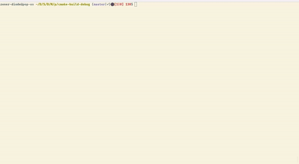

# puzzle-solver
[](https://github.com/zenon8adams/copywrite/actions/workflows/base-ci.yml)


A command line tool that solve word search puzzles

## Example

## Building
Run:
```sh
mkdir cmake-build
cd cmake-build
cmake ..
cmake --build .
```
## Note
You can use the [word scrambler](https://github.com/zenon8adams/WordScrambler) program
to generate puzzle files for this program.
